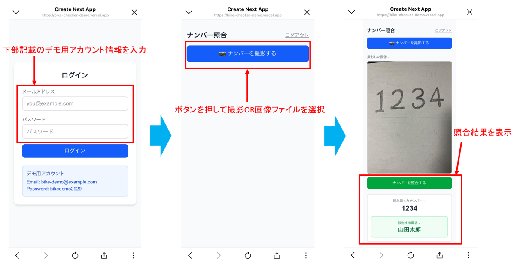

# バイクナンバー照合アプリ（デモ版）

スマートフォンでバイクのナンバープレートを撮影すると、AIが番号を読み取り、登録された顧客データと照合して「どの顧客のバイクか」を表示するWebアプリです。

## 開発の背景

母がバイクショップを経営しており、整備の際に「この車両がどのお客様のものか確認したいが、そのたびに事務室まで戻って顧客台帳を調べるのが手間だ」と漏らしていたことがきっかけです。

作業の現場で、手元のスマートフォンからナンバープレートを撮影するだけで顧客を特定できれば、確認のために往復する手間がなくなります。身近な人の実際の困りごとを解決したいという思いから、このアプリの開発を始めました。

> **注意:** 本リポジトリは就職活動用のデモ版です。掲載されている顧客データはすべて架空のものであり、実在の個人情報は一切含まれていません。

## デモ

実際に動作するデモを公開しています。スマートフォンでアクセスすると、カメラ撮影から照合までの一連の流れを体験できます。

**デモURL:** https://bike-checker-demo.vercel.app/

**デモ用アカウント**

| 項目 | 値 |
|------|-----|
| メールアドレス | bike-demo@example.com |
| パスワード | bikedemo2929 |

**試し方**

1. 上記URLにアクセスし、デモ用アカウントでログインします（ログイン画面にも情報を表示しています）。
2. 「ナンバーを撮影する」から画像を選択、またはカメラで撮影します。
3. 「ナンバーを読み取る」を押すと、AIが番号を読み取り、結果が編集可能な欄に表示されます。
4. 読み取り結果が正しければそのまま、誤っていればその場で数字を修正し、「このナンバーで照合する」を押すと顧客データと照合します。

デモ用データには以下を登録しています。手元に実物がない場合は、紙に番号を書いて撮影しても試せます。

| ナンバー | 顧客名 |
|---------|--------|
| 1234 | 山田太郎 |
| 1234 | 佐藤次郎 |
| 5678 | 佐藤花子 |
| 9999 | 鈴木一郎 |
| 4321 | 田中美咲 |
| 7777 | 高橋健太 |

登録のない番号を読み取らせると「該当する顧客が見つかりませんでした」と表示されます。また、同じ番号で複数の顧客が登録されている場合は、該当者全員が一覧で表示されます。

## 主な機能

- **ナンバープレートの撮影** — スマートフォンのカメラで撮影、または画像ファイルを選択できます。
- **AIによる番号認識** — 撮影画像から、ナンバープレートの一連指定番号（中央の数字）を読み取ります。
- **読み取り結果の手直し** — AIの読み取り結果を編集可能な欄に表示し、誤りがあればその場で修正してから照合できます。
- **顧客照合** — 読み取った（または修正した）番号をデータベースと照合し、該当する顧客を表示します。
- **複数該当の表示** — 同じ番号で複数の顧客が登録されている場合は、該当者全員を人数とともに表示します。
- **ログイン認証** — 登録されたユーザーのみが利用できます。未ログインのアクセスはログイン画面に誘導されます。

## 技術構成

| 領域 | 使用技術 |
|------|---------|
| フロントエンド | Next.js（App Router）/ React / TypeScript |
| スタイリング | Tailwind CSS |
| 認証・データベース | Supabase（Auth / PostgreSQL） |
| 画像認識（AI） | Claude API（Anthropic） |
| ホスティング | Vercel |

フロントエンドからデータベースまでをNext.jsとSupabaseで一貫して構築し、画像認識にはClaudeの画像理解を利用しています。

## 工夫した点

ナンバープレートの読み取りには、従来から使われているOCR（文字認識）という選択肢もありました。しかし今回は、Claude API（画像理解AI）を採用しました。

理由は、本アプリの利用シーンが「整備の現場で、スマートフォンを手に持って撮影する」ものであり、撮影される画像の条件が一定しないためです。プレートが傾いていたり、背景に余計なものが写り込んだり、光の当たり方が様々であったりと、現場での撮影は決してきれいな条件ばかりではありません。

Claude APIは、単に文字を抽出するだけでなく、画像全体の文脈を理解できます。「これは日本のバイクのナンバープレートで、中央に大きく書かれた数字を読み取ってほしい」という指示を自然な日本語で与えるだけで、多少の傾きや余計な情報があっても、読み取るべき箇所を判断してくれます。これにより、撮影条件のばらつきに対する細かな前処理を作り込むことなく、シンプルな実装で実用的な精度を得られました。

### AIの精度を人の手で補う設計

実際に運用してみると、撮影条件によってはAIの読み取りが完璧ではない場面もありました。そこで、読み取り結果をそのまま確定させるのではなく、一度編集可能な欄に表示し、利用者が確認・修正してから照合する流れにしました。AIによる自動化と人による最終確認を組み合わせることで、認識精度に左右されすぎず、現場で確実に使える形を目指しています。

### 現実のデータに合わせた複数該当への対応

ナンバーの一連指定番号は、数字だけで見ると異なる車両どうしで一致する場合があります。該当者が複数いるのに1人だけを表示すると誤認につながるため、同じ番号に複数の顧客が該当する場合は全員を表示するようにしました。

### セキュリティ

- **APIキーの管理** — Supabaseおよびクラウド上のAIサービスのキーは環境変数で管理し、ソースコードには一切含めていません。リポジトリにも公開していません。
- **サーバーサイドでのAI呼び出し** — AIサービスの秘密鍵はブラウザに露出させず、サーバーサイドの処理（API Route）の中だけで使用しています。
- **行単位のアクセス制御（RLS）** — データベースにRow Level Securityを設定し、ログイン済みユーザーのみが顧客データを参照できるよう制限しています。
- **アクセス制御** — 未ログイン状態でトップページにアクセスした場合、自動的にログイン画面へ誘導します。

### スマートフォン対応

- 実機検証の結果、スマートフォンの高解像度な写真がそのままでは送信サイズの上限を超える問題を発見しました。撮影画像を送信前に自動でリサイズ・圧縮する処理を追加し、認識精度を保ちつつ安定して動作するよう改善しています。

## 開発を通して

Webアプリ開発の初挑戦として、認証・データベース・AIによる画像認識・クラウドへのデプロイまで、一通りの流れを実装しました。

身近な人の困りごとを起点にしたことで、「実際に現場で使えるか」を常に意識しながら開発を進められました。特に、ローカル環境では問題なく動作していた処理が、実機（スマートフォン）や本番環境で初めて不具合として表面化する場面があり、原因の切り分けと修正を通して「動くものを、実際に使える状態まで仕上げる」ことの難しさと面白さを学びました。

また、公開後も一度きりで終わらせず、実際に使う中で見えた課題（読み取りの誤りを補正したい、同じ番号の顧客に対応したい等）をもとに機能を追加し、継続的に改善を重ねています。

> 本デモ版は機能を限定して公開しています。実店舗で運用しているバージョンには、店舗側で顧客データを追加・管理するための画面など、運用に必要な機能を別途実装しています。

## 今後の展望

- **撮影ガイドの表示** — 撮影時にプレートを枠に合わせるガイドを表示し、読み取り精度をさらに高める。
- **ひらがなを含めた照合** — 数字に加え、プレートのひらがな部分も用いて、より厳密に車両を特定する。
- **照合履歴の記録** — いつ・どの車両を照合したかの履歴機能。

## 作者

GitHub: [@UenoTatsuki](https://github.com/UenoTatsuki)
